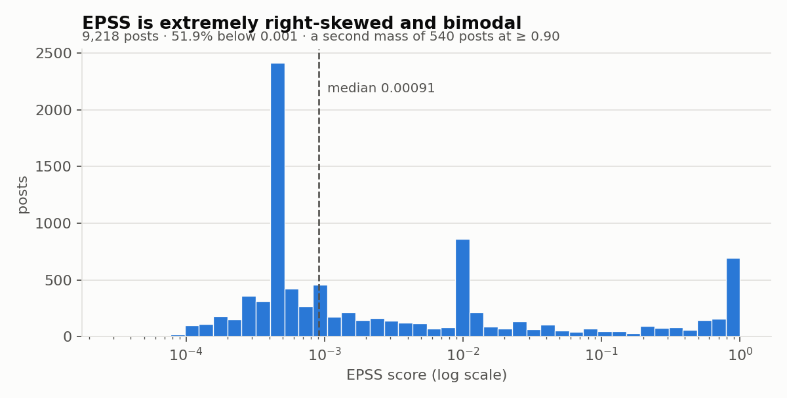
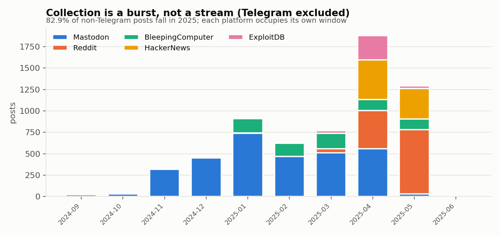
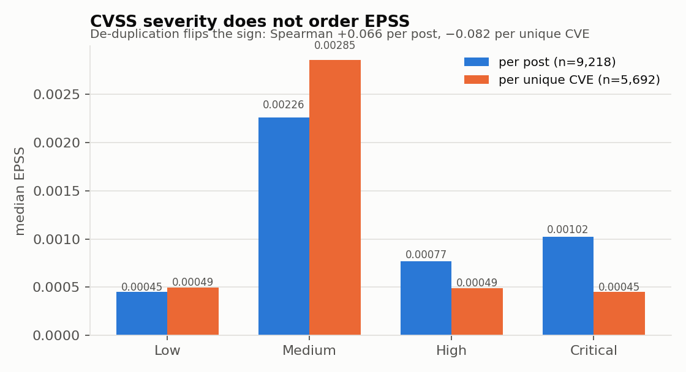
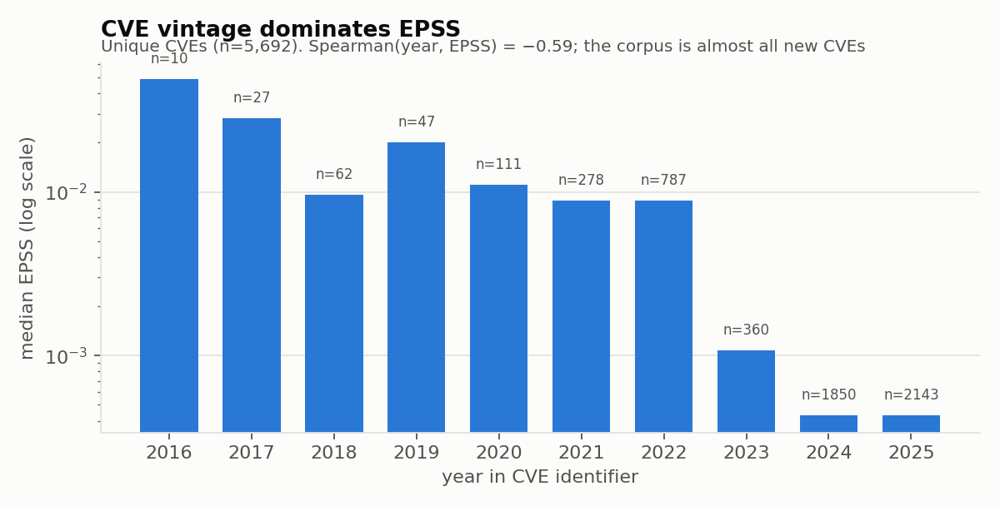
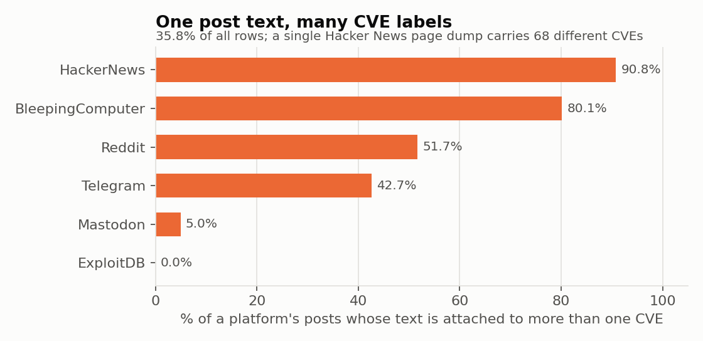

# Social Media Post (SMP) Corpus — Correlation & Feature Analysis

**Dataset:** `Social_Media_Dataset/Data_Files/` — `gemma_combined_summ.csv`, `gpt_combined_summ.csv`, `mistral_combined_summ.csv`
**Rows analysed:** 9,218 per file × 3 files · 28 columns each
**Date of analysis:** 2026-08-13
**Analyst note:** every figure quoted below was computed twice — once on `gemma_combined_summ.csv` and once independently on `mistral_combined_summ.csv` (and, where the code path allowed, with a second implementation). The verification log is in §12. Nothing in this report is asserted from inspection alone.

---

## 1. Executive summary

The corpus is a **CVE-centric social-media corpus**: each row is one social-media post paired with one CVE, its NVD/CVSS metadata, its EPSS score, and three LLM-generated summaries of the CVE's external evidence. The three CSV files are **the same dataset three times** — the 25 non-summary columns are byte-identical across all three files; only the four `summ_*` / `github_urls` columns differ.

The ten findings that matter most:

| # | Finding | Evidence |
|---|---|---|
| 1 | The three files differ **only** in the LLM summary columns. Treat them as one dataset with three summary variants, never as three datasets. | 25/25 shared columns byte-identical, row-aligned (§3) |
| 2 | The grain is **post × CVE**, not CVE. 9,218 rows cover only **5,692 distinct CVEs**; the `-N` suffix on the `cve` column is a within-CVE post counter. | §3 |
| 3 | **EPSS is bimodal and extreme**: median 0.00091, but 5.9% of posts sit at ≥ 0.90. Half the corpus is statistically indistinguishable from "no exploitation signal". | §5, Fig. 1 |
| 4 | **CVSS does not order EPSS.** Row-level Spearman is +0.066; de-duplicated to one row per CVE it *flips negative* (−0.082). Critical-rated CVEs have a **lower** median EPSS than Medium-rated ones. | §8, Fig. 4 |
| 5 | The single strongest driver of EPSS here is **CVE vintage**, not any vulnerability property: Spearman(CVE year, EPSS) = **−0.59**. 73.9% of rows are CVE-2024/2025, i.e. overwhelmingly young CVEs with near-floor EPSS. | §9, Fig. 3 |
| 6 | The apparent "platform predicts EPSS" effect (ε² = 0.247) is **mostly a vintage confound** — restricted to CVE-2025 only it collapses to ε² = 0.041. | §9 |
| 7 | **35.8% of rows share their post text with a different CVE.** One Hacker News page dump is attached to **68 distinct CVEs**. This is the corpus's most serious contamination risk. | §10, Fig. 5 |
| 8 | Hacker News rows are **not posts** — mean 92,779 characters, max 492,778, and only **136 unique texts across 816 rows**. They are whole-page scrapes. | §6, §10 |
| 9 | `epss_status` is not a neutral flag: `enriched` rows have a mean EPSS of 0.0047 vs 0.156 for `original` — a 33× gap, heavily concentrated in Mastodon (58.6% enriched). | §5 |
| 10 | The three LLM summary layers are **not interchangeable**. Gemma is the most complete and the most faithful (100% CVSS-score agreement, 0.05% "this isn't a real CVE" hallucination); Mistral drops 319 summaries it had input for and hallucinates non-existence in **4.1–7.5%** of its summaries. | §11 |

Only **Telegram** was excluded from every date-based analysis, per instruction: its `date_posted` records when the Telegram message was crafted, not when the underlying content was published. Telegram is retained in all non-temporal analyses and is always labelled where it appears.

---

## 2. Method & reproducibility

* Loading: `pandas.read_csv(..., low_memory=False)`; no type coercion beyond `date_posted → datetime64`.
* **Two grains are reported throughout.** Row level (n = 9,218) answers "what does a post look like". CVE level (n = 5,692, the earliest-dated row per CVE with a deterministic `cve`-string tie-break) answers "what does a vulnerability look like" and removes the popularity weighting that heavily-posted CVEs otherwise impose.
* Associations: Spearman ρ for monotone numeric relations (EPSS is not remotely normal, so Pearson is reported only alongside it and never alone); Kruskal–Wallis H with ε² effect size for categorical→EPSS; bias-corrected Cramér's V for categorical↔categorical; Mann–Whitney U with rank-biserial r for binary→EPSS.
* Predictive check: gradient-boosted trees, **5-fold `GroupKFold` grouped on base CVE** so that no CVE appears in both train and test — without this the duplicate-CVE structure inflates every score.
* Scripts and outputs are in this folder: `scripts/`, `figures/`, `tables/`.

---

## 3. Structure, grain and file relationship

**Files are one dataset, three summary variants.** All 25 non-summary columns (`cve`, `source`, `date_posted`, `time_posted`, `social_media_post`, `epss_score`, `epss_status`, `description`, `cvss_version`, `cvss_score`, the 8 CVSS sub-metrics, `occurrence_count`, `sources_available`, `github_links_with_code_available`, `days_since_latest_git_source`, `days_since_oldest_git_source`, `source_links`, `github_urls`) are **identical row-for-row across the three files**. Only column *order* differs: Mistral places `github_urls` before `summ_github_urls`; Gemma and GPT place it last.

**The grain is post × CVE.** The `cve` column is not a CVE identifier — it is `CVE-YYYY-NNNN-<k>`, where `<k>` is a 1-based counter over the posts collected for that CVE.

| Posts per CVE | 1 | 2 | 3 | 4 | 5 | 6–10 | 11–20 | > 20 |
|---|---|---|---|---|---|---|---|---|
| CVEs | 4,512 | 646 | 198 | 100 | 50 | 116 | 41 | 29 |

Most-covered CVEs: CVE-2025-32433 (51 posts), CVE-2025-31324 (48), CVE-2025-29927 (45), CVE-2025-24054 (42), CVE-2025-31201 (40).

**Consequence for modelling:** any random train/test split leaks. 4,706 rows (51%) belong to a CVE that appears more than once, and those rows share an identical label, description and CVSS vector. Splits must be grouped on the base CVE.

---

## 4. Feature dictionary (as observed, not as documented)

| Column | Type | Missing | What it actually contains |
|---|---|---|---|
| `cve` | str | 0 | `CVE-YYYY-NNNN-k` — CVE + within-CVE post index. 5,692 distinct base CVEs. |
| `source` | cat(6) | 0 | Mastodon 3,136 · Telegram 2,590 · Reddit 1,333 · HackerNews 816 · BleepingComputer 755 · ExploitDB 588 |
| `date_posted` | date | 0 | 2021-11-23 → 2025-06-01. **Telegram values are craft dates, not post dates.** |
| `time_posted` | str | 0 | Real only for Reddit and Telegram. 57.4% of rows are `00:00`; BleepingComputer, ExploitDB, HackerNews and Mastodon are **100% `00:00`** — the time is a placeholder for those four. |
| `social_media_post` | text | 5 | Median 442 chars, mean 9,281 — a mean 21× the median, driven entirely by Hacker News. |
| `epss_score` | float | 0 | **Target.** 0.00003 – 0.97542. Never exactly 0 or 1. |
| `epss_status` | cat(2) | 0 | `original` 6,200 · `enriched` 3,018. Not a neutral flag — see §5. |
| `description` | text | 0 | NVD description. Median 263 chars. Constant per CVE (1 CVE of 5,692 has two variants). |
| `cvss_version` | float | 0 | 3.1 (8,986) · 3.0 (232). No v2, no v4. |
| `cvss_score` | float | 0 | 1.9 – 10.0, mean 8.154, median 8.5. |
| 8 CVSS sub-metrics | cat | 0 | AV, AC, PR, UI, S, C, I, A. 438 distinct vectors. |
| `occurrence_count` | int | 0 | Intended = posts for this CVE. Correct for **99.58%** of rows; 39 rows disagree with the realised count. |
| `sources_available` | bool | 0 | True 7,636 — exactly matches `source_links` non-null. Fully redundant. |
| `github_links_with_code_available` | bool | 0 | True 1,424, but `github_urls` is non-null for 2,339 rows → the flag means "GitHub link **containing code**", not "any GitHub link". |
| `days_since_latest_git_source` | float | 7,323 | Days between post and newest linked git artefact. **457 of 1,895 are negative** — the code landed *after* the post. |
| `days_since_oldest_git_source` | float | 7,323 | Same for the oldest. 313 negative. No row violates `latest ≤ oldest`. |
| `source_links` | JSON list | 1,582 | External advisory/reference URLs. |
| `github_urls` | JSON list | 6,879 | GitHub URLs specifically. |
| `summ_all_sources` | text | varies | LLM summary of `source_links` content. |
| `summ_github_urls` | text | varies | LLM summary of GitHub artefacts. |
| `summ_cvss_metrics` | text | varies | LLM narration of the CVSS vector. |

### Redundancy found

* **`cvss_score` is a deterministic function of the 8 sub-metrics in this data**: all 438 distinct vectors map to exactly one score (0 violations), and a random forest reconstructs the score at R² = 0.992. Feed the model the vector **or** the score, not both.
* **`sources_available` ≡ `source_links.notna()`** — one of the two is dead weight.
* **`confidentiality_impact` ↔ `integrity_impact`** carry Cramér's V = 0.548 (and I↔A = 0.465, C↔A = 0.332). The impact triad is close to one latent factor.

---

## 5. The target: EPSS



| Statistic | Value |
|---|---|
| mean | 0.10665 |
| median | 0.00091 |
| p25 / p75 | 0.00043 / 0.01103 |
| p90 / p95 / p99 | 0.57231 / 0.92223 / 0.94454 |
| min / max | 0.00003 / 0.97542 |
| share < 0.001 | **51.91%** |
| count ≥ 0.90 | **540 (5.86%)** |

The distribution is not merely skewed, it is **bimodal**: a dense floor mass below 10⁻³ and a second peak in the 0.90–0.95 band. Modelling EPSS as a continuous regression target on the raw scale will be dominated by the floor. Either a logit transform or a binary high/low framing (e.g. ≥ 0.1) is required.

**Discrete value spikes.** A handful of exact values repeat far above chance and are platform-locked:

| EPSS value | rows | distinct CVEs | platform concentration |
|---|---|---|---|
| 0.00043 | 1,556 | 1,350 | Mastodon 1,424 |
| 0.00885 | 585 | 570 | **Telegram 585 (100%)** |
| 0.00045 | 292 | 232 | Mastodon 226 |
| 0.01156 | 100 | 18 | Telegram 99 |

0.00043 and 0.00045 are the EPSS floor for freshly-published CVEs — expected. **0.00885 appearing on 585 Telegram rows and nowhere else is not**: it indicates the Telegram slice was scored against a single EPSS snapshot. Combined with the craft-date problem, this is a second, independent reason to keep Telegram out of any time-sensitive analysis.

**`epss_status` is a confounded flag, not a provenance note.**

| status | n | mean EPSS | median EPSS |
|---|---|---|---|
| `original` | 6,200 | 0.15625 | 0.00195 |
| `enriched` | 3,018 | 0.00475 | 0.00045 |

A 33× mean gap. Enrichment is concentrated by platform (Mastodon 58.6%, Telegram 32.4%, BleepingComputer 20.1%, ExploitDB 12.6%, Reddit 5.8%, HackerNews 4.7%) — Cramér's V(`source`, `epss_status`) = **0.447**, by far the strongest categorical pairing in the dataset. `epss_status` therefore encodes *how the label was obtained*. Using it as a feature is target leakage; it belongs in the analysis as a stratification variable.

**EPSS is not stable within a CVE.** 521 of 5,692 base CVEs (9.2%) carry more than one distinct EPSS value across their rows — the score was fetched at different times. `cvss_score` and `description`, by contrast, are constant per CVE.

---

## 6. Platform profile

| Platform | posts | unique CVEs | median EPSS | mean EPSS | mean CVSS | % enriched | median post chars | date window |
|---|---|---|---|---|---|---|---|---|
| Mastodon | 3,136 | 2,860 | 0.00043 | 0.0086 | 8.81 | 58.6% | 176 | 2024-09-04 → 2025-05-20 |
| Telegram* | 2,590 | 1,845 | 0.00885 | 0.1161 | 7.69 | 32.4% | 490 | *craft dates — excluded from temporal work* |
| Reddit | 1,333 | 616 | 0.00174 | 0.1495 | 7.94 | 5.8% | 1,156 | 2021-11-23 → 2025-06-01 |
| HackerNews | 816 | 483 | 0.00738 | 0.2526 | 7.76 | 4.7% | 36,093 | 2025-04-07 → 2025-05-28 |
| BleepingComputer | 755 | 276 | 0.00228 | 0.1906 | 8.14 | 20.1% | 3,130 | 2025-01-04 → 2025-05-30 |
| ExploitDB | 588 | 362 | 0.00146 | 0.1804 | 7.77 | 12.6% | 1,474 | 2023-05-02 → 2025-05-29 |

Read this table with §9 in hand: the EPSS column ranks platforms mostly by the *age* of the CVEs each one happens to discuss.

**Hacker News is structurally different from everything else.** 816 rows, median 36,093 characters, max 492,778, and only **136 unique texts**. Inspection of the largest confirms they are entire scraped pages (a "Show HN" DevOps page, front-page dumps) rather than individual posts. Any text model trained on this corpus will spend most of its token budget on Hacker News boilerplate unrelated to the CVE.

**Anonymisation is partial and uneven.** `<URL>` placeholders appear in 58.6% of posts (mean 1.73 per post), but 15.1% of posts still contain a literal `http`. Coverage by platform: Mastodon 96.4%, ExploitDB 60.5%, Telegram 58.9%, HackerNews 32.2%, Reddit 14.3%, **BleepingComputer 0.3%**. No `<USER>` or `<EMAIL>` tokens exist anywhere — user handles were never masked.

**Platform overlap is thin.** 5,200 of 5,692 CVEs appear on exactly one platform; only 69 appear on four or more. Highest pairwise Jaccard is Reddit↔BleepingComputer at 0.112. There is very little cross-platform corroboration to exploit.

---

## 7. Temporal structure (Telegram excluded)



Non-Telegram: **6,628 rows, 4,187 unique CVEs, 2021-11-23 → 2025-06-01**, of which **82.86% fall in 2025**.

This is a **burst collection, not a continuous stream**, and each platform occupies a different window:

* Mastodon carries the corpus almost single-handedly from 2024-09 to 2024-12 (91–99% of posts each month; 320 in November, 450 in December).
* BleepingComputer starts 2025-01. Reddit ramps 2025-03. HackerNews and ExploitDB appear only in 2025-04/05.
* Peak month is 2025-04 (1,879 posts); 2025-06 has 14 posts (truncated collection).

**Implication:** a chronological train/test split will not be a time split — it will be a *platform* split. Early folds are Mastodon-only; late folds are Reddit/HackerNews-heavy. Combined with §6's platform-EPSS differences, this produces distribution shift that will be misread as concept drift.

**Posting lag.** 60.8% of non-Telegram posts appear in the same calendar year as the CVE identifier, 27.5% one year later. No post precedes its CVE year. Mean EPSS rises steeply with the gap — 0.045 at gap 0, 0.133 at gap 1, 0.333 at gap 2 — which is the CVE-maturation effect of §9, not a property of the discussion.

**Day-of-week.** Volume is weekday-heavy (Tue 1,480 → Sun 297) but median EPSS barely moves (0.0004–0.0019). No usable weekday signal.

**Who breaks a CVE first?** Of 289 CVEs covered by more than one non-Telegram platform, 229 have an unambiguous earliest platform (60 are same-day ties — `date_posted` is day-resolution, so this analysis is coarse by construction).

| First platform | CVEs | median lead over next platform |
|---|---|---|
| Mastodon | 109 | 16 days |
| BleepingComputer | 58 | 8.5 days |
| Reddit | 31 | 3 days |
| HackerNews | 22 | 4 days |
| ExploitDB | 9 | 354 days |

Mastodon is the earliest-signal platform in this corpus. ExploitDB's 354-day median is the opposite pattern: it archives exploits for CVEs the corpus discussed long before.

---

## 8. Correlation and association analysis

### 8.1 Numeric features vs EPSS

| Feature | n | Spearman ρ (row level) | Spearman ρ (CVE level) |
|---|---|---|---|
| `occurrence_count` | 9,218 | **+0.392** | +0.163 |
| post length (chars) | 9,218 | **+0.295** | — |
| `days_since_oldest_git_source` | 1,895 / 1,150 | +0.312 | +0.304 |
| `days_since_latest_git_source` | 1,895 / 1,150 | +0.298 | +0.271 |
| `cvss_score` | 9,218 | +0.066 | **−0.082** |

All p < 10⁻⁹. Two readings deserve care:

* **`occurrence_count` is the strongest tabular correlate (+0.392) and it is a popularity variable, not a vulnerability variable.** It is also mechanically tied to the row multiplicity — a CVE with 51 posts contributes 51 identical labels. At CVE level the correlation more than halves, to +0.163. It is legitimate as a feature only if the deployment scenario really does give you the post count in advance.
* **Post length correlates +0.295 with EPSS overall but the sign is not stable within platform**: HackerNews +0.405, ExploitDB +0.188, Mastodon +0.178, Reddit +0.106, BleepingComputer +0.087, **Telegram −0.180**. The pooled figure is a platform-composition artefact (long HackerNews scrapes happen to sit on higher-EPSS CVEs), not a "longer discussion ⇒ more exploitable" law.

### 8.2 CVSS vs EPSS — the sign flips on de-duplication



| CVSS severity band | per post: n / median EPSS | per unique CVE: n / median EPSS |
|---|---|---|
| Low (< 4.0) | 103 / 0.00045 | 84 / 0.00050 |
| Medium (4.0–6.9) | 1,594 / 0.00226 | 948 / 0.00286 |
| High (7.0–8.9) | 4,540 / 0.00077 | 2,947 / 0.00049 |
| Critical (9.0–10.0) | 2,981 / 0.00102 | 1,713 / 0.00045 |

The ordering is **non-monotone at both grains**, and at CVE level Critical is the *lowest* band. This is a textbook Simpson's reversal produced by duplication: high-CVSS CVEs attract more posts, so their rows are over-weighted at row level. **CVSS severity is not a proxy for exploitation likelihood in this corpus.**

### 8.3 CVSS sub-metrics vs EPSS (Kruskal–Wallis, row level)

| Sub-metric | H | p | ε² | Direction (mean EPSS) |
|---|---|---|---|---|
| `availability_impact` | 397.6 | 4.6e-87 | **0.0429** | NONE 0.116 ≈ HIGH 0.113 ≫ LOW 0.031 |
| `integrity_impact` | 214.3 | 2.9e-47 | 0.0230 | HIGH 0.122 > NONE 0.085 > LOW 0.033 |
| `confidentiality_impact` | 135.7 | 3.4e-30 | 0.0145 | HIGH 0.122 > LOW 0.061 > NONE 0.032 |
| `privileges_required` | 94.4 | 3.2e-21 | 0.0100 | NONE 0.144 > HIGH 0.065 > LOW 0.037 |
| `scope` | 72.4 | 1.8e-17 | 0.0077 | UNCHANGED 0.110 > CHANGED 0.094 |
| `attack_vector` | 59.9 | 6.1e-13 | 0.0062 | NETWORK 0.122 ≫ LOCAL 0.058 |
| `user_interaction` | 3.0 | 0.085 | 0.0002 | **not significant** |
| `attack_complexity` | 1.9 | 0.169 | 0.0001 | **not significant** |

Every effect size is small (ε² ≤ 0.043 — under 5% of rank variance). `attack_complexity` and `user_interaction`, the two metrics one would expect to gate exploitability hardest, carry **no** significant association with EPSS at all. Several directions are also non-intuitive (availability NONE ≈ HIGH; privileges HIGH > LOW), which is a further sign these are correlational shadows of CVE vintage rather than causal drivers.

### 8.4 Binary features

| Feature | mean EPSS True / False | Mann–Whitney p | rank-biserial r |
|---|---|---|---|
| `sources_available` | 0.1089 / 0.0960 | 1.6e-09 | +0.096 |
| `github_links_with_code_available` | 0.1341 / 0.1016 | 0.50 | +0.011 |

**Having public PoC code on GitHub carries no significant rank association with EPSS in this corpus** (p = 0.50). This is a strong negative result worth stating plainly — it contradicts the usual prior, and it is worth checking whether the flag is under-populated (see §10, defect D5) before drawing a substantive conclusion.

---

## 9. The dominant confound: CVE vintage



**Spearman(CVE year, EPSS) = −0.59** at CVE level (−0.57 under an alternative de-duplication rule) — an effect three to nine times larger than anything in §8.

| CVE year | unique CVEs | mean EPSS | median EPSS |
|---|---|---|---|
| ≤ 2022 | 1,339 | 0.0877 | 0.00885 |
| 2023 | 360 | 0.1244 | 0.00107 |
| 2024 | 1,850 | 0.0344 | 0.00043 |
| 2025 | 2,143 | 0.0021 | 0.00043 |

EPSS rises as evidence of exploitation accumulates, so old CVEs score high and new ones sit on the floor. **73.9% of rows (70.2% of unique CVEs) are CVE-2024 or CVE-2025**, so the label is compressed against the floor for most of the corpus, and any variable that correlates with vintage inherits a spurious EPSS correlation.

**This is exactly what happens to `source`.** Kruskal–Wallis on `source` gives ε² = **0.247** at CVE level — the largest categorical effect in the dataset. Restricted to CVE-2025 CVEs only, it drops to **ε² = 0.041**, a 6× collapse. Most of "platform predicts exploitability" is "platforms differ in the age of the CVEs they discuss".

The same mechanism explains the `days_since_*_git_source` correlations (+0.27 to +0.30): a large gap between post and git artefact means an old CVE, and old CVEs have high EPSS.

**Recommendation:** stratify or condition on CVE year in every analysis, and report platform/CVSS effects *within* vintage strata.

---

## 10. Data-quality defect register



| ID | Severity | Defect | Scale |
|---|---|---|---|
| **D1** | **Critical** | **One post text carries many CVE labels.** 6,416 unique texts for 9,218 rows; 684 texts map to > 1 distinct CVE, covering **3,296 rows (35.8%)**. Worst case: one HackerNews text on **68 CVEs** (204 rows). Per platform: HackerNews 90.8%, BleepingComputer 80.1%, Reddit 51.7%, Telegram 42.7%, Mastodon 5.0%, ExploitDB 0.0%. | 3,296 rows |
| **D2** | **Critical** | **Hacker News rows are page scrapes, not posts** — mean 92,779 chars, 136 unique texts across 816 rows. | 816 rows |
| **D3** | High | **Exact duplicate records** (same CVE + same platform + same post text): 893 rows in duplicate groups, 489 beyond the first. | 489 rows |
| **D4** | High | **Telegram dates are craft dates** (given), and Telegram additionally carries a single-snapshot EPSS artefact (585 rows at exactly 0.00885). | 2,590 rows |
| **D5** | Medium | **`github_links_with_code_available` is internally inconsistent** — 90 rows flagged True have no git dates; 561 rows flagged False do have them; 915 rows have `github_urls` but flag False. | 1,566 rows |
| **D6** | Medium | **457 of 1,895 `days_since_latest_git_source` values are negative** (git artefact postdates the post). Legitimate as a signal, fatal if treated as an unsigned age. | 457 rows |
| **D7** | Medium | **`time_posted` is a placeholder for 4 of 6 platforms** (100% `00:00`); 57.4% of the corpus overall. | 5,295 rows |
| **D8** | Low | **`occurrence_count` disagrees with the realised row count for 39 rows** (0.42%) — always by under-collection (e.g. CVE-2021-26855 claims 10, has 9). | 39 rows |
| **D9** | Low | **Anonymisation is partial** — 15.1% of posts still contain a literal `http`; BleepingComputer is essentially unmasked (0.3% `<URL>` coverage); handles/emails never masked. | 1,392 rows |
| **D10** | Low | `social_media_post` is null in 5 rows; one CVE has two different `description` values. | 6 rows |

---

## 11. The LLM summary layer — Gemma vs GPT vs Mistral

Three models summarised the same three inputs per row. They differ substantially in **coverage, verbosity, format and faithfulness**.

### 11.1 Coverage

Denominators: `source_links` present in 7,636 rows; `github_urls` present in 2,339 rows; all 9,218 rows have a CVSS vector.

| | `summ_all_sources` | missing vs input | `summ_github_urls` | missing vs input | `summ_cvss_metrics` | missing |
|---|---|---|---|---|---|---|
| **Gemma** | 7,636 | **0** | 2,381 | 7 | 9,218 | **0** |
| **GPT** | 7,606 | 30 | 2,246 | **141** | 9,218 | **0** |
| **Mistral** | 7,317 | **319** | 2,388 | 0 | 9,016 | **202** |

Gemma is the only model with complete coverage of the sources it was given. Mistral silently drops 319 source summaries and 202 CVSS summaries.

*(All three produce 48–49 `summ_github_urls` entries for rows where `github_urls` is null — verified: in every one of those cases the GitHub link lives inside `source_links` instead. That is an input-routing quirk, not a hallucination.)*

### 11.2 Verbosity and format fingerprint

| | median words: sources / github / cvss | `**bold**` in cvss summ. | bulleted lists in cvss summ. |
|---|---|---|---|
| Gemma | 72 / 74 / 65 | 3.9% | 0.0% |
| GPT | 103 / **197** / 84 | 12.2% | 9.3% |
| Mistral | 113 / 106 / **111** | **49.5%** | **74.2%** |

Mistral emits Markdown-structured output three-quarters of the time; Gemma emits near-plain prose. **A downstream text encoder will pick up the model's formatting habits as signal.** If the summaries are to be compared or fused, strip Markdown first.

### 11.3 Faithfulness

**CVSS numeric agreement** — does the summary state the same base score as the `cvss_score` column?

| | rows with a parseable stated score | agree | disagree |
|---|---|---|---|
| Gemma | 9,202 | **9,202 (100.00%)** | 0 |
| GPT | 5,697 | 5,696 (99.98%) | 1 |
| Mistral | 8,471 | 8,446 (99.70%) | 25 |

GPT states a score in far fewer summaries (it more often narrates the vector qualitatively), and its disagreements are rounding-style (`9.0` for 9.8, `6.0` for 6.5). Mistral's include hard errors (`0.0` for a true 8.8).

**"This vulnerability isn't real" hallucination** — the model asserts the CVE/advisory is hypothetical, fictional, a placeholder, or non-existent, because a 2024/2025 identifier falls past its training horizon:

| | in `summ_all_sources` | in `summ_github_urls` |
|---|---|---|
| Gemma | 4 / 7,636 = **0.05%** | 1 / 2,381 = 0.04% |
| GPT | 7 / 7,606 = 0.09% | 11 / 2,246 = 0.49% |
| Mistral | 303 / 7,317 = **4.14%** | 179 / 2,388 = **7.50%** |

Verified by reading samples. Representative Mistral output: *"The advisory VDE-2025-010 is a placeholder, as it uses a future year (2025) and a non-existent advisory number… The likelihood of exploitation is nonexistent as the vulnerability does not exist."* These summaries are **anti-informative** — they assert the opposite of the ground truth on ~480 rows.

**Truncation** (summary ends with no terminal punctuation, indicating a cut-off generation):

| | sources | github | cvss |
|---|---|---|---|
| Gemma | 25 (0.3%) | 2 (0.1%) | 0 (0.0%) |
| GPT | **401 (5.3%)** | 0 (0.0%) | 50 (0.5%) |
| Mistral | 154 (2.1%) | 32 (1.3%) | **256 (2.8%)** |

**Label leakage check:** no summary column mentions EPSS in Gemma or GPT; Mistral mentions it in 2 rows. The summary layer does not leak the target.

### 11.4 Agreement between models

Mean Jaccard similarity on content words (600-row random sample):

| Pair | `summ_all_sources` | `summ_github_urls` | `summ_cvss_metrics` |
|---|---|---|---|
| Gemma ↔ Mistral | 0.226 | 0.188 | 0.359 |
| Gemma ↔ GPT | 0.159 | 0.088 | 0.284 |
| GPT ↔ Mistral | 0.160 | 0.097 | 0.282 |

Even on `summ_cvss_metrics` — a fully deterministic input where all three models see the identical 8-field vector — agreement peaks at 0.36. The summary columns are **three genuinely different views**, which makes them useful as an ensemble/multi-view input but unsafe to treat as interchangeable.

### 11.5 Verdict

**Gemma** for a single-summary pipeline: complete coverage, 100% numeric faithfulness, negligible hallucination, minimal formatting noise — at the cost of being the tersest. **GPT** is the middle option, with a notable 5.3% truncation rate on source summaries. **Mistral** is the most verbose and most structured but is the only model with a material correctness problem; if it is used, the ~480 "not a real vulnerability" rows should be detected and dropped or regenerated.

---

## 12. Predictive baseline — how much signal is actually there?

Target: `epss_score ≥ 0.1` (positive rate 15.48%, n = 1,427). Gradient-boosted trees, 5-fold `GroupKFold` grouped on base CVE.

| Feature set | ROC-AUC | PR-AUC |
|---|---|---|
| CVE year only | 0.606 | 0.239 |
| CVSS score + 8 sub-metrics | 0.717 | 0.267 |
| `source` only | 0.723 | 0.268 |
| Metadata (`occurrence_count`, source/github flags, git-day deltas) | 0.805 | 0.418 |
| CVSS + metadata | 0.852 | 0.526 |
| **All tabular** (+ source + CVE year) | **0.899** | **0.627** |

Interpretation: **the tabular metadata carries more signal than the CVSS vector** (0.805 vs 0.717). But a large share of that comes from `occurrence_count` and `source`, i.e. from *how the corpus was collected*, not from the vulnerability. This is the number to beat with the post text and the LLM summaries — and the honest comparison is against the CVSS-only 0.717 baseline, not against chance.

---

## 13. Recommendations

1. **Split on base CVE, always.** 51% of rows share a CVE with another row. Ungrouped CV will overstate performance substantially.
2. **De-duplicate post texts before training.** Drop or down-weight the 3,296 rows (35.8%) whose post text is attached to more than one CVE — the text cannot be discriminative for a label it shares with 67 other CVEs.
3. **Handle Hacker News separately.** Either truncate to the CVE-relevant span, or exclude the platform; 816 rows of 90k-character page dumps will otherwise dominate any text pipeline.
4. **Stratify on CVE year.** It is the largest single driver of EPSS (ρ = −0.59) and it confounds `source`, `days_since_*_git_source`, and post length.
5. **Do not use `epss_status` as a feature** — it describes label provenance and is 33× separated on the target. Use it to stratify, or restrict to `original` (n = 6,200) for a cleaner experiment.
6. **Pick one of `cvss_score` / the 8 sub-metrics**, not both — the score is a deterministic function of the vector here.
7. **Model EPSS on the logit scale or as a binary target.** The raw scale is bimodal with 52% of mass below 0.001.
8. **Treat `occurrence_count` as a collection artefact.** Report results with and without it; it is the strongest tabular correlate (ρ = +0.392) and it is not available at prediction time in a realistic deployment.
9. **Restore or re-derive `time_posted`** if intra-day ordering matters — it is a placeholder for 4 of 6 platforms.
10. **If a single summary variant must be chosen, use Gemma**; if all three are used, strip Markdown and filter Mistral's non-existence hallucinations first.

---

## 14. Verification log

Every headline number was recomputed independently. Cross-checks performed:

| Check | Method A | Method B | Result |
|---|---|---|---|
| Row/column counts | `pandas.read_csv` | raw `csv.reader` on all 3 files | 9,218 × 28 in all three — **agree** |
| Base-CVE extraction | regex `^(CVE-\d{4}-\d+)` | `str.split("-").str[:3].join` | 5,692 unique — **agree** |
| Shared columns identical across files | `Series.equals` per column | string-cast + null-aligned compare | 25/25 identical — **agree** |
| EPSS moments | gemma file | mistral file | mean 0.10665, median 0.00091 — **agree** |
| CVSS severity shares | gemma | mistral | High 49.25 / Critical 32.34 / Medium 17.29 / Low 1.12 — **agree** |
| Simpson reversal | Spearman ρ | median-by-band table | both show row-level + / CVE-level − — **agree** |
| Post-text reuse | md5 hashing | `pd.factorize` on raw strings | 684 texts / 3,296 rows / max 68 CVEs — **agree** |
| Summary coverage | `notna()` | `notna() & strip() != ""` | identical — no whitespace-only summaries |
| CVSS faithfulness | loose regex (initial) | strict score-anchored regex | initial run mis-parsed `3.1` (CVSS *version*) as a score; corrected figures in §11.3 are from the strict pattern |
| "Not a real CVE" rate | keyword regex | manual reading of flagged samples | wording confirmed; regex tightened after inspection |
| "Future" mentions | keyword regex | manual reading of flagged samples | **rejected** — most hits were benign ("could be used in coordinated attacks in the future"). Not reported as a finding. |
| First-poster analysis | `groupby().first()` after sort | explicit min-date + tie detection | first method was tie-unstable; §7 reports only the 229 unambiguous cases |

Two claims were **withdrawn** during verification and do not appear as findings above: a "temporal disbelief" rate based on the word *future* (benign in context), and an initial CVSS-mismatch count that was an artefact of matching the CVSS *version* number.

---

## 15. Contents of this folder

```
SMP corelation analysis/
├── README.md                              this report
├── figures/
│   ├── fig1_epss_distribution.png
│   ├── fig2_monthly_volume_by_platform.png
│   ├── fig3_epss_by_cve_year.png
│   ├── fig4_cvss_vs_epss_simpson.png
│   └── fig5_post_text_reuse.png
├── tables/
│   ├── platform_profile.csv
│   ├── epss_by_cve_year.csv
│   └── monthly_volume_no_telegram.csv
└── scripts/
    ├── 01_structure_and_grain.py
    ├── 02_features_epss_cvss.py
    ├── 03_correlations.py
    ├── 04_cve_level_and_duplication.py
    ├── 05_summary_coverage_and_text.py
    ├── 06_summary_quality.py
    ├── 07_temporal_no_telegram.py
    ├── 08_reuse_and_baseline.py
    ├── 09_cross_platform.py
    ├── 10_figures.py
    ├── verify_pass1.py
    └── verify_pass2.py
```
